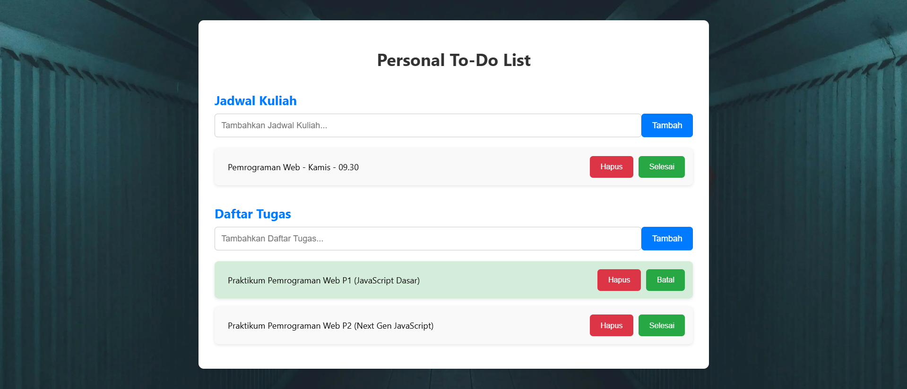

# Personal To-Do List

Personal To-Do List adalah aplikasi berbasis web yang membantu pengguna untuk mengelola jadwal kuliah dan daftar tugas secara efisien. Pengguna dapat menambahkan, mengedit, menghapus, serta menandai tugas yang telah selesai. Data disimpan secara lokal menggunakan `localStorage`, sehingga data tetap tersedia meskipun aplikasi ditutup dan dibuka kembali.

## Fitur Utama
Aplikasi ini memiliki beberapa fitur utama yang membantu penggunanya mengelola tugas dan jadwal kuliah mereka.

### 1. **Tambah Jadwal Kuliah**
Pengguna dapat menambahkan jadwal kuliah dengan menginputkan nama mata kuliah dan menambahkannya ke dalam daftar jadwal.

### 2. **Tambah Tugas**
Pengguna dapat menambahkan tugas yang perlu diselesaikan, dengan rincian nama tugas yang perlu dikerjakan.

### 3. **Tandai Tugas Selesai**
Setelah menyelesaikan tugas, pengguna dapat menandainya dengan klik tombol "Selesai". Tugas yang sudah selesai akan diberi tanda coret dan berwarna hijau.

### 4. **Edit dan Hapus Tugas**
Pengguna dapat mengedit tugas jika ada perubahan atau menghapus tugas jika tidak perlu lagi.

### 5. **Simpan Data dengan LocalStorage**
Data jadwal kuliah dan daftar tugas disimpan menggunakan `localStorage`, sehingga data tetap ada meskipun aplikasi ditutup dan dibuka kembali.

## Teknologi yang Digunakan
Aplikasi ini dibangun menggunakan teknologi berikut:

- **HTML** untuk struktur halaman web.
- **CSS** untuk styling dan desain tampilan.
- **JavaScript (ES6+)** untuk logika aplikasi dan interaksi pengguna.
  - Menggunakan fitur modern JavaScript seperti `let` dan `const`, `arrow functions`, `template literals`, dan `async/await`

## Fitur ES6+ yang Diimplementasikan
Aplikasi ini menggunakan beberapa fitur modern JavaScript (ES6+) untuk memberikan pengalaman yang lebih baik, antara lain:

- **`let` dan `const`** untuk deklarasi variabel yang lebih aman.
- **`Arrow functions`** untuk penulisan fungsi yang lebih ringkas dan mudah dipahami.
- **`Template literals`** untuk manipulasi string yang lebih mudah dan dinamis.
- **`Async/Await`** untuk pengelolaan operasi asinkron yang lebih mudah dibaca dan dipahami.

## Screenshot
Berikut adalah tampilan dari aplikasi:

Terima kasih telah menggunakan **Personal To-Do List**!
